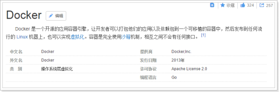
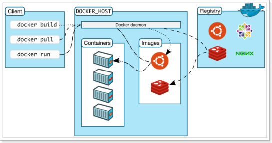

# 				Docker 详述

##Docker 简介

## 为什么要用Docker？

### 更高效的利用系统资源

由于容器不需要进行硬件虚拟以及运行完整操作系统等额外开销，Docker对系统资源的利用率更高，无论是应用执行速度，内存消耗以及文件存储速度，都要比传统虚拟机技术更高效。因此，相比虚拟机技术，一个相同配置的主机，往往可以运行更多数量的应用。

### 更快速的启动时间

传统的虚拟机技术启动应用服务往往需要数分钟，而Docker容器应用，由于直接运行与宿主内核，无序启动完整的操作系统，因此可以做到妙级，甚至毫秒级的启动时间，大大的节约了开发，测试，部署的时间。

### 一致的运行环境

开发过程中一个常见的问题是环境一致性问题，由于开发环境，测试环境，生产环境不一致，导致有些bug并未在开发过程中被发现，而Docker的镜像提供了除内核外完整的运行时环境，确保了应用运行环境一致性。从而不会再出现（这段代码在我机器上运行没问题啊）zz这类问题。

### 持续交付和部署

对于开发和运维人员来说，最希望的就是一次创建或配置，可以在任意地方正常运行。

使用Docker可以通过定制应用镜像来实现持续集成，持续交付，部署。开发人员可以通过Dockerfile来进行镜像构建，并结合持续集成系统进行集成测试，而运维人员则可以在生产环境中快速部署该镜像，甚至结合持续部署系统进行自动部署

### 更轻松的迁移

由于Docker确保了执行环境的一致性，使得应用的迁移更加容易，Docker可以在很多平台上运行，无论是物理机，虚拟机，公有云，私有云，甚至是比较本，其运行结果是一致的，因此用户可以很轻易的将在一个平台上运行的应用，迁移到另一个平台上，而不用担心运行环境的变化导致应用无法正常运行的情况。

### 更轻松的维护和扩展

Docker使用的分层存数以及镜像的技术，使得应用重复部分的复用更为容易，也使得应用的维护更新更加简单，基于基础镜像进一步扩展镜像也变得非常简单，此外，Docker团队同各个开源项目团队一起维护了一大批高质量的官方镜像，既可以直接在生产环境使用，又可以作为基础进一步定制，大大的降低了应用服务的镜像制作成本。

## 架构图

### Docker daemon （Docker 进程）：

Docker 进程是部署在linux操作系统之上的，负责支撑Docker Container 的运行以及本地的image（镜像） 的管理    

### Docker Client：

用户不直接操作Docker daemon ，用户通过Docker Client 来访问Docker ，Docker Client 提供  pull,run等操作命令

### Docker Image：

Docker 镜像 就是一个只读的模板。

例如：一个镜像可以包含一个完整的centOs操作系统环境，里面也可以包含安装了的各种应用程序。  

镜像可以用来创造 Docker 容器  

Docker 提供了一个很简单的机制来创建镜像或者更新现有的镜像，用户甚至可以直接从其他人那里下载一个已经做好的镜像来直接使用。  

### Docker Containr（容器）：

Docker 利用容器来运行应用，container（容器）是从镜像创建的运行实例。它可以被启动，开始，停止，删除。每个容器都是相互隔离的，保证安全的平台。images 和container 区别：先有镜像再有容器，容器是镜像的实例。  

### Docker Registry（仓库）：

Docker Registry 分公开仓库和私有仓库，类似于Maven 的共有仓库 和本地库 的情况。其中 Docker 的最大的公有仓库是Docker Hub，存放了大量的镜像提供下载，用户也可以在本地创建一个私有仓库。  

当用户创建了自己的镜像之后就可以使用 push 命令将它上传到公有或者私有仓库，这样下次在另外一台机器上使用这个镜像时候，只需要从仓库上 pull 下来就可以了。

# 后续学习请直接上菜鸟网站即可

Dcoker学习地址[链接地址](https://www.runoob.com/docker/docker-architecture.html )

